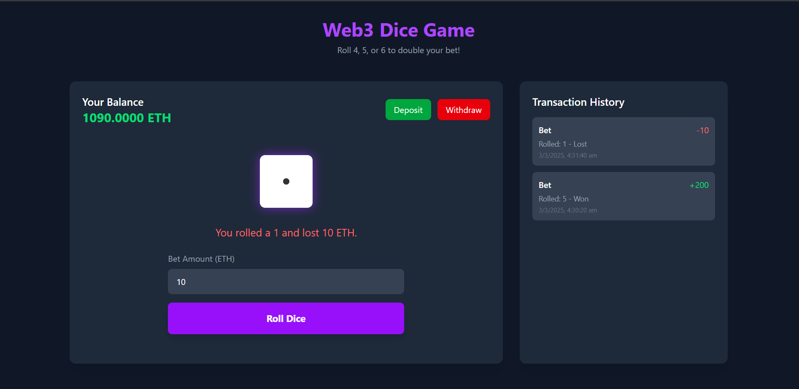

# BetProvably
### A web3 based dice betting game

This project implements a provably fair dice game using a smart contract deployed on the Sepolia testnet.
- Every **random value** from 1-6 is chosen by the **smart contract** itself making it **truly provably fair**!
- Everything is handled using blockchain and no backend is there that reduces the chances of any unlikely results. Everything is transparent and same for everybody.

Contract Address
The smart contract for this dice game is deployed on the Sepolia testnet at the following address:

`0x2aF3733Be093331b70b4Ff07141C4F3FD3960b55`
Check it out here: https://sepolia.etherscan.io/address/0x2aF3733Be093331b70b4Ff07141C4F3FD3960b55

### How to play?
To play the game, you need a metamask wallet with sepolia eth tokens in it.
- If you donot have any sepolia tokens, head to https://cloud.google.com/application/web3/faucet/ethereum/sepolia and paste your wallet address to get 0.05 SepoliaETH.

Now you are ready to play the game! - GO ahead!
[Play Here](https://inquisitive-llama-c967c9.netlify.app/)

Further Improvements I would be making:
- Improved Dice Animations
- Result time optimization
- Caching for transaction histories, etc

Hope you liked it
Kartik Bindra
[Linkedin](https://www/linkedin.com/in/kartik-bindra)
[Github](https://www/github.com/kartikbindra)
